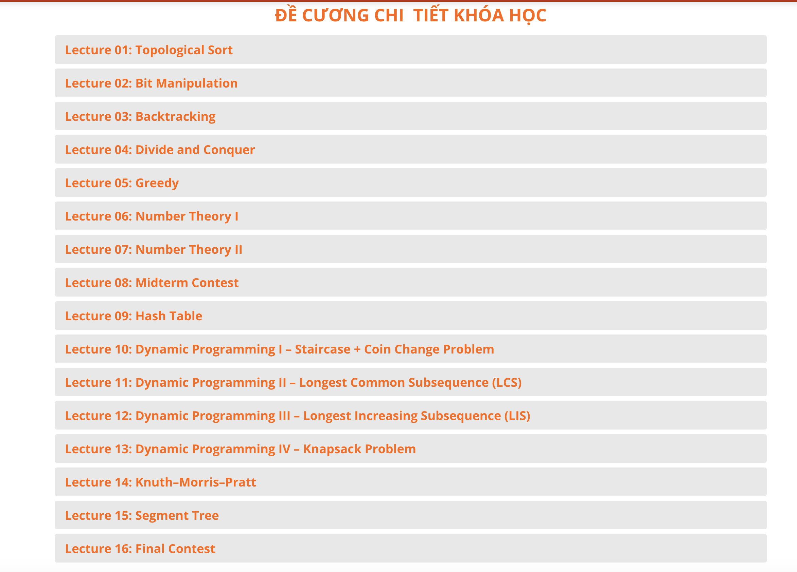

# :heart: Big-O Coding course :heart:
Big-O Coding courses

## Green - 0

<!--  -->

- Lecture 01: Introduction
- Lecture 02: Conditional Statements
- Lecture 03: Loop Statements
- Lecture 04: User Defined Function
- Lecture 05: Array
- Lecture 06: Matrix (2D Array)
- Lecture 07: String
- Lecture 08: Midterm Contest
- Lecture 09: Recursion
- Lecture 10: Data Abstraction
- Lecture 11: Sorting
- Lecture 12: Singly Linked List
- Lecture 13: Review
- Lecture 14: Trees
- Lecture 15: Graphs
- Lecture 16: Final Contest

## Blue - 1
<!--  -->

- Lecture 01: Dynamic Array & String
- Lecture 02: Algorithmic Complexity
- Lecture 03: Sorting
- Lecture 04: Stack & Queue
- Lecture 05: BFS
- Lecture 06: DFS
- Lecture 07: Heap
- Lecture 08: Dijkstra
- Lecture 09: Midterm Contest
- Lecture 10: Bellman - Ford
- Lecture 11: Floyd – Warshall
- Lecture 12: Binary Search
- Lecture 13: Binary Search Tree
- Lecture 14: Trie
- Lecture 15: Prim
- Lecture 16: Disjoint Set Union
- Lecture 17 & 18: Ôn tập và Final Contest.

## Orange - 2
<!--  -->
- Lecture 01: Topological Sort
- Lecture 02: Bit Manipulation
- Lecture 03: Backtracking
- Lecture 04: Divide and Conquer
- Lecture 05: Greedy
- Lecture 06: Number Theory I
- Lecture 07: Number Theory II
- Lecture 08: Midterm Contest
- Lecture 09: Hash Table
- Lecture 10: Dynamic Programming I – Staircase + Coin Change Problem
- Lecture 11: Dynamic Programming II – Longest Common Subsequence (LCS)
- Lecture 12: Dynamic Programming III – Longest Increasing Subsequence (LIS)
- Lecture 13: Dynamic Programming IV – Knapsack Problem
- Lecture 14: Knuth–Morris–Pratt
- Lecture 15: Segment Tree
- Lecture 16: Final Contest

## CP - Advance
### level 1
<!--  -->
- Lecture 1: Algorithm Complexity
- Lecture 2: Sorting
- Lecture 3: Linear Search & Binary Search
- Lecture 4: Exercises 01
- Lecture 5: Counting
- Lecture 6: Bit Manipulation
- Lecture 7: Two Pointers
- Lecture 8: Exercises 02
- Lecture 9: Greedy
- Lecture 10: Stack and Queue
- Lecture 11: BFS & DFS
- Lecture 12: Midterm Contest
- Lecture 13: Heap
- Lecture 14: Dijkstra
- Lecture 15: Bellman & Floyd
- Lecture 16: Exercises 03
- Lecture 17: Disjoint Sets
- Lecture 18: Prim
- Lecture 19: Kruskal
- Lecture 20: Exercises 04
- Lecture 21: Final Contest

### level 2
<!--  -->
- Lecture 01: Topological Sort
- Lecture 02: Bridge, Cut vertex, Connected, Component
- Lecture 03: Backtracking
- Lecture 04: Exercises 01
- Lecture 05: Generation
- Lecture 06: Branch and Bound
- Lecture 07: Chu trình Hamilton, Euler
- Lecture 08: Exercises 02
- Lecture 09: Modular Arithmetic
- Lecture 10: Greatest Common Divisor
- Lecture 11: Prime Number
- Lecture 12: Midterm Contest
- Lecture 13: Divide and Conquer
- Lecture 14: Fibonacci, Prefix Sum
- Lecture 15: Coin Change
- Lecture 16: Exercises 03
- Lecture 17: Longest Common Subsequence
- Lecture 18: Longest Increasing Subsequence
- Lecture 19: Knapsack
- Lecture 20: Exercises 04
- Lecture 21: Final Contest

### level 3
<!--  -->
- Lecture 01: Deque
- Lecture 02: Hash Table
- Lecture 03: Sparse Table
- Lecture 04: Exercises 01
- Lecture 05: Segment Tree
- Lecture 06: Fenwick Tree
- Lecture 07: Lowest Common Ancestor
- Lecture 08: Exercises 02
- Lecture 09: Knuth-Morris-Pratt
- Lecture 10: Z Function
- Lecture 11: Trie
- Lecture 12: Midterm Contest
- Lecture 13: Suffix Array
- Lecture 14: Manacher
- Lecture 15: Combinatorics and Chinese Remainder Theorem
- Lecture 16: Exercises 03
- Lecture 17: Probabilities
- Lecture 18: Inclusion-Exclusion Principle
- Lecture 19: Catalan Number
- Lecture 20: Exercises 04
- Lecture 21: Final Contest

### level 4
<!--  -->
- Lecture 01: Matrix multiplication, exponentiation, inversion
- Lecture 02: Binary Lifting
- Lecture 03: Geometry I (Line, Point, General conics)
- Lecture 04: Exercises 01
- Lecture 05: Geometry II - Convex Hull (Bao lồi)
- Lecture 06: Dynamic Programming V (Edit Distance)
- Lecture 07: Dynamic Programming VI (Bit Mask)
- Lecture 08: Exercises 02
- Lecture 09: Dynamic Programming VII (DP on tree)
- Lecture 10: Dynamic Programming VIII (Digit)
- Lecture 11: DP Optimization with Knuth-Yao
- Lecture 12: Midterm Contest
- Lecture 13: DP Optimization with Convex Hull trick
- Lecture 14: Maximum Flow (Ford-Fulkerson, Dinic Algorithm)
- Lecture 15: Minimum cost, Maximum Flow
- Lecture 16: Exercises 03
- Lecture 17: Game Theory I (dp)
- Lecture 18: Game Theory II (adhoc)
- Lecture 19: Game Theory III (Sprague-Grundy)
- Lecture 20: Exercises 04
- Lecture 21: Final Contest